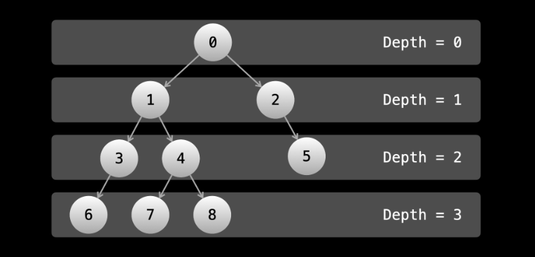

# Binary trees - BFS

In breadth-first search (BFS), we prioritize breadth. In BFS, we traverse all nodes at a given depth before moving on to the next depth. So if you performed BFS on a large complete binary tree, the depth of the nodes you would traverse would look like 0, 1, 1, 2, 2, 2, 2, 3, 3, ....

    A "complete" binary tree is one where every level (except possibly the last) is full, and all the nodes in the last level are as left as possible.

We can think of each depth of a tree as a "level", as if the tree was a building with the root being the top floor and the edges were staircases down to a lower floor.



A BFS performed on the above tree would visit the nodes in the same order as their values. We visit all nodes at a depth d before visiting any node at a depth of d + 1.

While DFS was implemented using a stack (recursion uses a stack under the hood), BFS is implemented iteratively with a queue. You can implement BFS with recursion, but it wouldn't make sense as it's a lot more difficult without any benefit. As such, we will look only at iterative implementations in this course.

## When to use BFS vs DFS?

We mentioned earlier that in many problems, it doesn't matter if you choose preorder, inorder, or postorder DFS, the important thing is that you just visit all nodes. If you have a problem like this, then it doesn't matter if you use BFS either, because every "visit" to a node will store sufficient information irrespective of visit order.

Because of this, in terms of binary tree algorithm problems, it is very rare to find a problem that using DFS is "better" than using BFS. However, implementing DFS is usually quicker because it requires less code, and is easier to implement if using recursion, so for problems where BFS/DFS doesn't matter, most people end up using DFS.

On the flip side, there are quite a few problems where using BFS makes way more sense algorithmically than using DFS. Usually, this applies to any problem where we want to handle the nodes according to their level. We'll see this in the upcoming example and practice problems.

In an interview, you may be asked some trivia regarding BFS vs DFS, such as their drawbacks. The main disadvantage of DFS is that you could end up wasting a lot of time looking for a value. Let's say that you had a huge tree, and you were looking for a value that is stored in the root's right child. If you do DFS prioritizing left before right, then you will search the entire left subtree, which could be hundreds of thousands if not millions of operations. Meanwhile, the node is literally one operation away from the root. The main disadvantage of BFS is that if the node you're searching for is near the bottom, then you will waste a lot of time searching through all the levels to reach the bottom.

In terms of space complexity, DFS uses space linear with the height of the tree (the maximum depth), whereas BFS uses space linear with the level that has the most nodes. In some cases, DFS will use less space, in other cases, BFS will use less.


```js
let printAllNodes = root => {
    let queue = [root];
    while (queue.length) {
        let nodesInCurrentLevel = queue.length;
        let nextQueue = [];

        for (let i = 0; i < nodesInCurrentLevel; i++) {
            let node = queue[i];

            // do some logic here on the current node
            console.log(node.val);

            // put the next level onto the queue
            if (node.left) {
                nextQueue.push(node.left);
            }
            if (node.right) {
                nextQueue.push(node.right);
            }
        }

        queue = nextQueue;
    }
}
```

With an efficient queue, the dequeue and enqueue operations are O(1), which means that the time complexity of BFS is the same as DFS. Again, the main idea is that we visit each node only once, so the time complexity is O(n⋅k) where n is the total number of nodes, and k is the amount of work we do at each node, usually O(1). Let's look at some example problems.

## Examples

#### Binary Tree Right Side View

Given the root of a binary tree, imagine yourself standing on the right side of it. Return the values of the nodes you can see ordered from top to bottom.

Essentially, this question is asking for the rightmost node at each level. If we do BFS with the same code format as above, we have a moment at each while loop iteration where we have an entire level in an array. If we prioritize the left children before the right children, then the final value at each iteration will be the rightmost node.

```js
/**
 * @param {TreeNode} root
 * @return {number[]}
 */
var rightSideView = function(root) {
    if (!root) {
        return [];
    }
    
    let ans = [];
    let queue = [root];

    while (queue.length) {
        let nodesInCurrentLevel = queue.length;
        let nextQueue = [];
        
        ans.push(queue[queue.length - 1].val); // this is the rightmost node for the current level
        for (let i = 0; i < nodesInCurrentLevel; i++) {
            let node = queue[i];
            if (node.left) {
                nextQueue.push(node.left);
            }
            if (node.right) {
                nextQueue.push(node.right);
            }
        }
        
        queue = nextQueue;
    }
    
    return ans;
};
```

This algorithm has a time and space complexity of O(n) for the same reasons as the algorithms in the previous article. We visit each node only once and perform a constant amount of work at each node. The queue could hold up to O(n) nodes.


#### Find Largest Value in Each Tree Row

Given the root of a binary tree, return an array of the largest value in each row of the tree.

```js
/**
 * @param {TreeNode} root
 * @return {number[]}
 */
var largestValues = function(root) {
    if (!root) {
        return [];
    }
    
    let ans = [];
    let queue = [root];

    while (queue.length) {
        let currentLength = queue.length;
        let currMax = -Infinity; // this will store the largest value for the current level
        let nextQueue = [];

        for (let i = 0; i < currentLength; i++) {
            let node = queue[i];
            currMax = Math.max(currMax, node.val);
            if (node.left) {
                nextQueue.push(node.left);
            }
            if (node.right) {
                nextQueue.push(node.right);
            }
        }
        
        ans.push(currMax);
        queue = nextQueue;
    }
    
    return ans;
};
```

The time and space complexity is O(n) for the same reasons as the previous example.

As mentioned before, for binary trees BFS vs DFS rarely matters. However, there are some cases where BFS really shines, like in these examples. When we get to graph problems, we'll see some more problems where BFS is very powerful. In the meantime, try the next few practice problems using BFS on your own.

