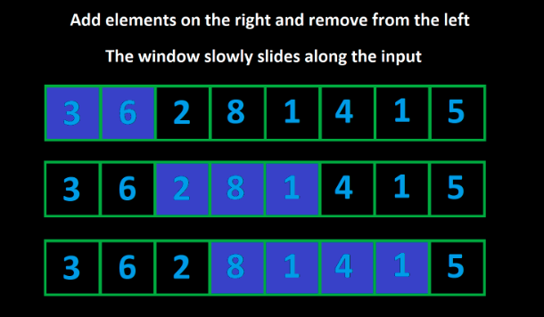

# Sliding window

Sliding windows work the same with arrays and strings - the important thing is that they're iterables with ordered elements. 

## How Does It Work?

The idea behind a sliding window is to consider only valid subarrays. Recall that a subarray can be defined by a left bound (the index of the first element) and a right bound (the index of the last element). In sliding window, we maintain two variables left and right, which at any given time represent the current subarray under consideration.

Initially, we have left = right = 0, which means that the first subarray we look at is just the first element of the array on its own. We want to expand the size of our "window", and we do that by incrementing right. When we increment right, this is like "adding" a new element to our window.

But what if after adding a new element, the subarray becomes invalid? We need to "remove" some elements from our window until it becomes valid again. To "remove" elements, we can increment left, which shrinks our window.

As we add and remove elements, we are "sliding" our window along the input from left to right. The window's size is constantly changing - it grows as large as it can until it's invalid, and then it shrinks. However, it always slides along to the right, until we reach the end of the input.



### Implementation

Now that you have an idea of how sliding window works, let's talk about how to implement it. For this section, we will use the previous example (find the longest subarray with a sum less than or equal to k).

As described above, we need to identify a constraint metric. In our example, the constraint metric is the sum of the window. How do we keep track of the sum of the window as elements are added and removed? One way that we could do it is by keeping the window in a separate array. When we add elements from the right, we add them to our array. When we remove elements from the left, we remove the corresponding elements from the array. This way, we can always find the sum of our current window just by summing the elements in the separate array.

This is very inefficient as removing elements and finding the sum of the window will be O(n) operations. How can we do better?

We don't actually need to store the window in a separate array. All we need is some variable, let's call it curr, that keeps track of the current sum. When we add a new element from the right, we just do curr += nums[right]. When we remove an element from the left, we just do curr -= nums[left]. This way, all operations are done in O(1).

Next, how do we move the pointers left and right? Remember, we want to keep expanding our window, and the window always slides to the right - it just might shrink a few times in between. Because right is always moving forward, we can use a for loop to iterate right over the input. In each iteration of the for loop, we will be adding the element nums[right] to our window.

What about left? When we move left, we are shrinking our window. We only shrink our window when it becomes invalid. By maintaining curr, we can easily tell if the current window is valid by checking the condition curr <= k. When we add a new element and the window becomes invalid, we may need to remove multiple elements from the left. For example, let's say nums = [1, 1, 1, 3] and k = 3. When we arrive at the 3 and add it to the window, the window becomes invalid. We need to remove three elements from the left before the window becomes valid again.

This suggests that we should use a while loop to perform the removals. The condition will be while (curr > k) (while the window is invalid). To perform the removals, we do curr -= nums[left] and then increment left in each iteration of the while loop.

Finally, how do we update the answer? In each for loop iteration, after the while loop, the current window is valid. We can write code here to update the answer. The formula for the length of a window is right - left + 1.


### Pseudocode

```js
function fn(nums, k):
    left = 0
    curr = 0
    answer = 0
    for (int right = 0; right < nums.length; right++):
        curr += nums[right]
        while (curr > k):
            curr -= nums[left]
            left++

        answer = max(answer, right - left + 1)

    return answer
```

or 

```js 
function fn(arr):
    left = 0
    for (int right = 0; right < arr.length; right++):
        Do some logic to "add" element at arr[right] to window

        while WINDOW_IS_INVALID:
            Do some logic to "remove" element at arr[left] from window
            left++

        Do some logic to update the answer
```


To explain why this algorithm works, let's look at a specific example. Let's say that we are given a positive integer array nums and an integer k. We need to find the length of the longest subarray that has a sum less than or equal to k. For this example, let nums = [3, 2, 1, 3, 1, 1] and k = 5.

Initialliy, we have left = right = 0, so our window is only the first element: [3]. Now, let's expand to the right until the constraint is broken. This will occur when left = 0, right = 2, and our window is: [3, 2, 1]. The sum here is 6, which is greater than k. We must now shrink the window from the left until the constraint is no longer broken. After removing one element, the window becomes valid again: [2, 1].

Why is it correct to remove this 3 and forget about it for the rest of the algorithm? Because the input only has positive integers, a longer subarray directly equals a larger sum. We know that [3, 2, 1] already results in a sum that is too large. There is no way for us to ever have a valid window again if we keep this 3 because if we were to add any more elements from the right, the sum would only get larger. That's why we can forget about the 3 for the rest of the algorithm.
### Complexity

In terms of time complexity, any algorithm that looks at every subarray will be at least 
O(n^2), which is usually too slow. A sliding window guarantees a maximum of 2n window iterations - the right pointer can move n times and the left pointer can move n times. This means if the logic done for each window is O(1), sliding window algorithms run in O(n), which is much faster.

You may be thinking: there is a while loop inside of the for loop, isn't the time complexity 
O(n^2) The reason it is still O(n) is that the while loop can only iterate n times in total for the entire algorithm (left starts at 0, only increases, and never exceeds n). If the while loop were to run n times on one iteration of the for loop, that would mean it wouldn't run at all for all the other iterations of the for loop. This is what we refer to as amortized analysis - even though the worst case for an iteration inside the for loop is O(n), it averages out to O(1) when you consider the entire runtime of the algorithm.

## When should we use sliding window?

There is a very common group of problems involving subarrays that can be solved efficiently with sliding window. 

    Whenever a problem description talks about subarrays, you should figure 
    out if sliding window is a good option by analyzing the problem description. 
    If you can find the things mentioned below, then it's a good bet.

First, the problem will either explicitly or implicitly define criteria that make a **subarray "valid"**. There are 2 components regarding what makes a subarray valid:

1. A constraint metric. This is some attribute of a subarray. It could be the sum, the number of unique elements, the frequency of a specific element, or any other attribute.

2. A numeric restriction on the constraint metric. This is what the constraint metric should be for a subarray to be considered valid.

Second, the problem will ask you to find valid subarrays in some way.

1. The most common task you will see is finding the best valid subarray. The problem will define what makes a subarray better than another. For example, a problem might ask you to find the longest valid subarray.

1. Another common task is finding the number of valid subarrays. We will take a look at this later in the article.

1. You need to find the subrange in this array or string that should provide the longest, shortest, or target values.

1. A classic problem: to find the largest/smallest sum of given k (for example, three) consecutive numbers in an array.

## Examples

1. #### Subarray Product Less Than K.

    Given an array of positive integers nums and an integer k, return the number of subarrays where the product of all the elements in the subarray is strictly less than k.

    For example, given the input nums = [10, 5, 2, 6], k = 100, the answer is 8. The subarrays with products less than k are:

    [10], [5], [2], [6], [10, 5], [5, 2], [2, 6], [5, 2, 6]

    ```js
    var numSubarrayProductLessThanK = function(nums, k) {
        if (k <= 1) {
            return 0;
        }

        let ans = 0, left = 0, curr = 1;
        
        for (let right = 0; right < nums.length; right++) {
            curr *= nums[right];
            while (curr >= k) {
                curr /= nums[left];
                left++;
            }
            
            ans += right - left + 1;
        }
        
        return ans;
    };
    ```

1. #### Find the length of the longest subarrat

    Given an array of positive integers nums and an integer k, find the length of the longest subarray whose sum is less than or equal to k. This is the problem we have been talking about above. We will now formally solve it.

    ```js
    var findLength = function(nums, k) {
        // curr is the current sum of the window
        let left = 0, curr = 0, ans = 0;
        for (let right = 0; right < nums.length; right++) {
            curr += nums[right];
            while (curr > k) {
                curr -= nums[left];
                left++;
            }
            ans = Math.max(ans, right - left + 1);
        }
        return ans;
    }
    ```

1. #### Binary String
    You are given a binary string s (a string containing only "0" and "1"). You may choose up to one "0" and flip it to a "1". What is the length of the longest substring achievable that contains only "1"?

    For example, given s = "1101100111", the answer is 5. If you perform the flip at index 2, the string becomes 1111100111.

    ```js
    var findLength = function(s) {
        // curr is the current number of zeros in the window
        let left = 0, curr = 0, ans = 0;
        for (let right = 0; right < s.length; right++) {
            if (s[right] == "0") {
                curr++;
            }
            
            while (curr > 1) {
                if (s[left] == "0") {
                    curr -= 1;
                }
                left++;
            }
            
            ans = Math.max(ans, right - left + 1);
        }
        
        return ans;
    }
    ```

1. #### Sum of the subarray
   
    Given an integer array nums and an integer k, find the sum of the subarray with the largest sum whose length is k.

    ```js
    var findBestSubarray = function(nums, k) {
        let curr = 0;
        for (let i = 0; i < k; i++) {
            curr += nums[i];
        }
        
        let ans = curr;
        for (let i = k; i < nums.length; i++) {
            curr += nums[i] - nums[i - k];
            ans = Math.max(ans, curr);
        }
        
        return ans;
    }
    ```