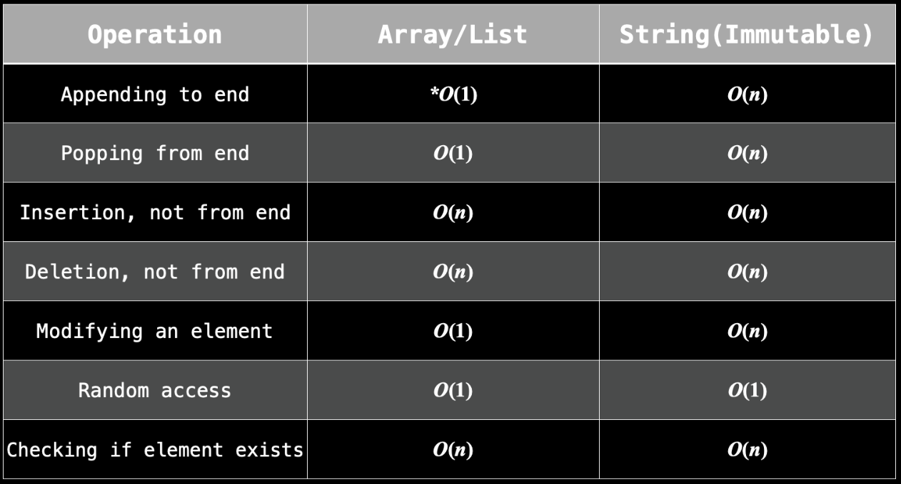

## Arrays

## Hash maps

The following operations are all O(1) for a hash map:

- Add an element and associate it with a value
- Delete an element if it exists
- Check if an element exists

Hash tables can also take up more space. Dynamic arrays are actually fixed-size arrays that resize themselves when they go beyond their capacity. Hash tables are also implemented using a fixed size array - remember that the size is a limit set by the programmer. The problem is, resizing a hash table is much more expensive because every existing key needs to be re-hashed, and also a hash table may use an array that is significantly larger than the number of elements stored, resulting in a huge waste of space. Let's say you chose your limit as 10,000 items, but you only end up storing 10. Okay, you could argue that 10,000 is too large, but then what if your next test case ends up needing to store 100,000 elements? The point is, when you don't know how many elements you need to store, arrays are more flexible with resizing and not wasting space.

    Note: remember that time complexity functions only involve the variables you define. When we say that hash map operations are O(1), the variable we are concerned with is usually n, which is the size of the hash map. However, this may be misleading. For example, hashing a string requires O(m) time, where m is the length of the string. The constant time operations are only constant relative to the size of the map.

## Sets

A set is another data structure that is very similar to a hash table. It uses the same mechanism for hashing keys into integers. The difference between a set and hash table is that sets do not map their keys to anything. Sets are more convenient to use when you only care about checking if elements exist. You can add, remove, and check if an element exists in a set all in O(1).

## Linked List

The main advantage of a linked list is that you can add and remove elements at any position in 
O(1). The caveat is that you need to have a reference to a node at the position in which you want to perform the addition/removal, otherwise the operation is O(n), because you will need to iterate starting from the head until you get to the desired position. However, this is still much better than a normal (dynamic) array, which requires O(n) for adding and removing from an arbitrary position.

The main disadvantage of a linked list is that there is no random access. If you have a large linked list and want to access the 150,000th element, then there usually isn't a better way than to start at the head and iterate 150,000 times. So while an array has O(1) indexing, a linked list could require O(n) to access an element at a given position.