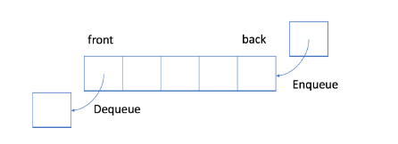
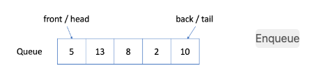
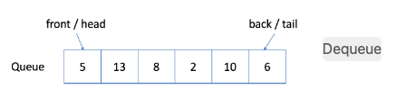
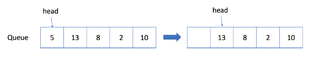
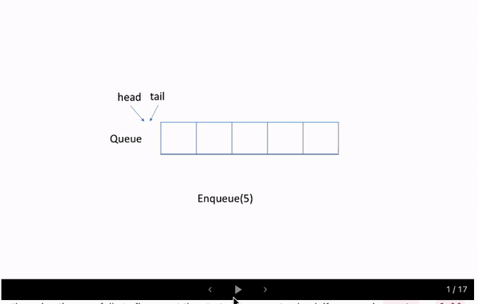

# Queue

In a queue, elements are added and removed from opposite sides. Like with a stack, there are multiple ways to implement a queue, but the important thing that defines it is the abstract interface of adding and removing from opposite sides.

Queues are trickier to implement than stacks if you want to maintain good performance. Like a stack, you could just use a dynamic array, but operations on the front of the array (adding or removal) are O(n), where n is the size of the array. Adding to a queue is called enqueue and deletions are called dequeue. If you want these operations to be O(1), you'll need a more sophisticated implementation.

One way to implement an efficient queue is by using a doubly linked list. Recall that with a doubly linked list, if you have the pointer to a node, you can add or delete at that location in O(1). A doubly linked list that maintains pointers to the head and tail (both ends, usually with sentinel nodes) can implement an efficient queue.

## Understanding Queues


Horizontal structure 
FIFO - First in First Out



In a FIFO data structure, the first element added to the queue will be processed first.

As shown in the picture above, the queue is a typical FIFO data stucture. The insert operation is also called enqueue and the new element is always added at the end of the queue. The delete operation is called dequeue. You are only allowed to remove the first element.

Example Queue

1. Enqueue: you can click Enqueue below to see how a new element 6 is added to the queue.

    

2. Dequeue: you can click Dequeue below to see which element will be removed.

    

    ```js

    function understandQueue() {
        // JavaScript doesn't have any built-in efficient queue
        const queue = [];

        // enqueue
        queue.push(1)
        queue.push(2)
        queue.push(3)

        printQueue(queue)

        // Output: [1, 2, 3]
        // Pushing all new elements to the back of the line

        // Get size
        // Output: 3
        queue.length; 

        // Check element at front of queue (next element to be removed)
        // Output: 1
        queue[0]; 

        // dequeue
        queue.shift()
        queue.shift()

        printQueue(queue)

        // Output: [3]
        // Remove two elements from the front of the line

    }

    function printQueue(queue) {
        console.log(queue)
    }

    ```

## The Five Methods of a Queue

- **Enqueue** - add elements to the queue from the back
- **Dequeue** - remove element from the queue from the front
- **Peek** - Returns the head of the queue. Returns null if the queue is empty.
- **Empty** - A boolean to check if the queue is empty
- **Size** - Returns the length of the queue
- **Contains** - A boolean to check if a value is in the queue


## When is it used:

- Event Loop in the broswer (task queue)
- Line of people
- Keyboard buffer
- Printer queues 
- Linkedlist, priority queues, breath first search

## Drawbacks

With the movement of the start pointer, more and more space is wasted. And it will be unacceptable when we only have a space limitation.

Let's consider a situation when we are only able to allocate an array whose maximum length is 5. Our solution works well when we have only added less than 5 elements. For example, if we only called the enqueue function four times and we want to enqueue an element 10, we will succeed.

And it is reasonable that we can not accept more enqueue request because the queue is full now. But what if we dequeue an element? 



Actually, we should be able to accept one more element in this case.

## Efficient Use

A more efficient way is to use a circular queue. Specifically, we may use a fixed-size array and two pointers to indicate the starting position and the ending position. And the goal is to reuse the wasted storage we mentioned previously.



### Implimentation

Implement the MyCircularQueue class:

- MyCircularQueue(k) Initializes the object with the size of the queue to be k.
- int Front() Gets the front item from the queue. If the queue is empty, return -1.
- int Rear() Gets the last item from the queue. If the queue is empty, return -1.
- boolean enQueue(int value) Inserts an element into the circular queue. Return true if the operation is successful.
- boolean deQueue() Deletes an element from the circular queue. Return true if the operation is successful.
- boolean isEmpty() Checks whether the circular queue is empty or not.
- boolean isFull() Checks whether the circular queue is full or not.

```js
class MyCircularQueue {
    constructor() {
        this.storage = [];
        this.size = 0;
        this.maxSize = 5;
        this.head = null;
        this.tail = null;
    }

    front() {
        if (this.size === 0 || this.head) return -1;
        return this.storage[this.head];
    }

    rear() {
        if (this.size === 0 || this.tail) return -1;
        return this.storage[this.tail];
    }

    enqueue(value) {
        if (this.size === this.maxSize) return false;
        if (!this.head && !this.tail) {
            this.storage.push(value);
            this.head = 0;
            this.tail = 0;
            this.size++;
            return true;
        } else if (this.tail === this.maxSize) {
            this.storage.push(value);
            this.tail = 0;
            this.size++;
            return true;
        } else {
            this.storage.push(value);
            this.tail++;
            this.size++;
            return true;
        }
    }
    // Head: 0
    // [1,2,3]
    // Head: 1
    // [ ,2,3]
    dequeue() {
        if (this.size === 0) return false;
        if (this.head === this.maxSize) {
            this.storage.shift();
            this.head = 0;
            this.size--;
            return true;
        } else if (this.head === this.tail) {
            this.storage.shift();
            this.head = null;
            this.tail = null;
            this.size--;
            return true;
        } else {
            this.storage.shift();
            this.head++;
            this.size--;
            return true;
        }
    }

    isEmpty() {
        return this.size === 0;
    }

    isFull() {
        return this.size === this.maxSixe;
    }
}
```