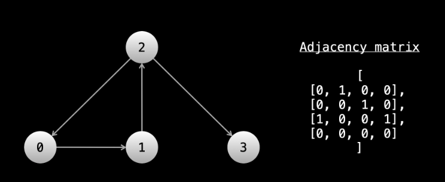

# Graph

A graph is any collection of nodes and their pointers to other nodes. In fact, linked lists and trees are both types of graphs. As a topic, graphs are extremely broad. There is an entire field of study dedicated to graphs called graph theory.

Even though a tree is a type of graph, trees and graphs are considered different topics when it comes to algorithm problems. Because graphs are the more advanced/difficult topic, we will start by looking at trees.

    The nodes of a graph are also called vertices, and the pointers that connect them are called edges. In graphical representations, nodes/vertices are usually represented with circles and the edges are lines/arrows that connect the circles (we saw this in the linked lists chapter).

#### Graph terminology

Edges of a node can either be directed or undirected. Directed edges mean that you can only traverse in one direction. If you're at node A and there is a directed edge to node B, you can move from A -> B, but once you're at B you can't move B -> A. In graphical representations, directed edges will be arrows between nodes. Undirected edges mean that you can traverse in both directions. So using the same example, you can move from A -> B and B -> A. In graphical representations, undirected edges will just be straight lines between nodes.

    In binary trees, the edges were directed. Binary trees are directed graphs. You can't access a node's parent, only its children. Once you move to a child, you can't move back.

A connected component of a graph is a group of nodes that are connected by edges. 

    In binary trees, there must only be one connected component (all nodes are reachable from the root).

A node can have any number of edges connected to it. If we have a directed graph, it can have any number of edges leaving it and any number of edges entering it. The number of edges that can be used to reach the node is the node's indegree. The number of edges that can be used to leave the node is the node's outdegree. Nodes that are connected by an edge are called neighbors. So if you have a graph like A <-> B <-> C, A is neighbors with B, B is neighbors with A and C, and C is neighbors with B.

    In binary trees, all nodes except the root had an indegree of 1 (due to their parent). All nodes have an outdegree of 0, 1, or 2. An outdegree of 0 means that it is a leaf. Specific to trees, we used the parent/child terms instead of "neighbors".

A graph can be either cyclic or acyclic. Cyclic means that the graph has a cycle, acyclic means that it doesn't. We learned what a cycle was in the linked list chapter - it's when you have a path in the edges that leads to visiting the same nodes infinitely. 

    Binary trees by definition cannot have a cycle.

In linked list problems, the head of the linked list is given. In binary tree problems, the root of the tree is given. In graph problems, only information about a graph is given. There are multiple common formats that this information can come in. We will take a look at a few.

    An important thing to understand is that with linked lists and binary trees, you are literally given objects in memory that contain data and pointers. With graphs, the graph doesn't literally exist in memory.

    In fact, only the "idea" of the graph exists. The input will give you some information about it, and it's up to you to figure out how to represent and traverse the graph with code.

    Many times, the nodes of a graph will be labeled from 0 to n - 1. The problem statement may or may not explicitly state the input is a graph. Sometimes there might be a story, and you need to determine that the input is a graph. For example, "there are n cities labeled from 0 to n - 1". You can treat each city as a node and each city has a unique label.

First input format: array of edges

In this input format, the input will be a 2D array. Each element of the array will be in the form [x, y], which indicates that there is an edge between x and y. The problem may have a story for these edges - using the cities example, the story would be something like "[x, y] means there is a highway connecting city x and city y".

Before starting the traversal, we can pre-process the input so that we can easily find all neighbors of any given node. Ideally, you want a data structure where you can give node as an argument and be returned a list of neighbors. The easiest way to accomplish this is using a hash map.

Let's say you had a hash map graph that mapped integers to lists of integers. We can iterate over the input and for each [x, y] pair, we can put y in the list associated with graph[x]. If the edges are undirected, we will also need to put x in the list associated with graph[y]. After building this hash map, we can do graph[0] and immediately have all the neighbors of node 0.

This example graph can be represented by an array of directed edges: edges = [[0, 1], [1, 2], [2, 0], [2, 3]].

```js
let buildGraph = edges => {
    let graph = new Map();
    for (const [x, y] of edges) {
        if (!graph.has(x)) {
            graph.set(x, []);
        }

        graph.get(x).push(y);

        // if (!graph.has(y)) {
        //     graph.set(y, []);
        // }

        // graph.get(y).push(x);
        // uncomment the above lines if the graph is undirected
    }
}
```

Second input format: adjacency list

In an adjacency list, the nodes will be numbered from 0 to n - 1. The input will be a 2D integer array, let's call it graph. graph[i] will be a list of all the outgoing edges from the ith node.

The graph in the image above can be represented by the adjacency list graph = [[1], [2], [0, 3], []].

Notice that with this input, we can already access all the neighbors of any given node. We don't need to do any pre-processing! This makes an adjacency list the most convenient format. If we want all the neighbors of node 6, we just check graph[6].

Third input format: adjacency matrix

The next format is an adjacency matrix. Once again, the nodes will be numbered from 0 to n - 1. You will be given a 2D matrix of size n x n, let's call it graph. If graph[i][j] == 1, that means there is an outgoing edge from node i to node j. For example:



When given this format, you have two options. During the traversal, at any given node you can iterate over graph[node], and if graph[node][i] == 1, then you know that node i is a neighbor. Alternatively, you can pre-process the graph as we did with an array of edges. Build a hash map and then iterate over the entire graph. If graph[i][j] == 1, then put j in the list associated with graph[i]. This way, when performing the traversal, you will not need to iterate n times at every node to find the neighbors. This is especially useful when nodes have only a few neighbors and n is large.

Both of these approaches will have a time complexity of O(n^2).

Last input format: matrix

The last format we'll talk about is more subtle but very common. The input will be a 2D matrix and the problem will describe a story. Each square will represent something, and the squares will be connected in some way. For example, "Each square of the matrix is a village. Villages trade with their neighboring villages, which are the villages directly above, to the left, to the right, or below them."

In this case, each square (row, col) of the matrix is a node, and the neighbors are (row - 1, col), (row, col - 1), (row + 1, col), (row, col + 1) (if in bounds).

#### Code differences between graphs and trees

There are a few big differences between solving graph problems and solving binary tree problems. While a binary tree has a root node to start traversal from, a graph does not always have an obvious "start" point.


For a binary tree, we are given objects for the nodes, and each node has a pointer to its children. In a graph, we might need to convert the input into a hash map first. When traversing a tree, we refer to node.left and node.right at each node. When traversing a graph, we will need to use a for loop to iterate over the neighbors of the current node, since a node could have any number of neighbors.

Implementation of DFS for graphs is similar to implementation for trees. Doing it recursively follows the same format: check for the base case, recursively call on all neighbors, do some logic to calculate the answer, and return the answer. You can also do it iteratively using a stack.

In any undirected graph or a directed graph with cycles, implementing DFS the same way we did with binary trees will result in an infinite cycle (remember linked list cycles? Imagine having your code walk in a circle forever!). Like with trees, in most graph questions, we only need to (and want to) visit each node once. To prevent cycles and unnecessarily visiting a node more than once, we can use a set seen. Before we visit a node, we first check if the node is in seen. If it isn't, we add it to seen before visiting it. This allows us to only visit each node once in O(1) time because adding and checking for existence in a set takes constant time.

    This wasn't necessary with trees because we started at the root and the edges only moved "down" - once we left a node, there was no way to get back to it. With graphs, you could have a relationship like A <-> B, and move between A and B forever.


As for which node we should start traversing from, this will depend on the problem and what you are trying to solve. Let's jump into some examples in the next article. It is recommended that you keep this article open in a separate tab to use as a reference.


#### What is a tree?

Like a linked list, a tree is a type of graph. Also like a linked list, there are multiple types of trees. In this course, we will be focusing on binary trees. Let's take a look at what a binary tree is.

#### Tree terminology

There is some tree-specific terminology that you will need to learn.

The root node is the node at the "top" of the tree. Every node in the tree is accessible starting from the root node. In most tree questions, the root of the tree will be given as the input, just like how in linked lists, the head was given as the input.

If you have a node A with an edge to a node B, so A -> B, we call A the parent of node B, and node B a child of node A.

If a node has no children, it is called a leaf node. The leaf nodes are the leaves of the tree.

The depth of a node is how far it is from the root node. The root has a depth of 0. Every child has a depth of parentsDepth + 1, so the root's children have a depth of 1, their children have a depth of 2, and so on.

Lastly, perhaps the most important thing to understand: a subtree of a tree is a node and all its descendants. Trees are recursive - you can treat a subtree as if it was its own tree with the chosen node being the root.

This is the most fundamental idea for solving tree problems - you can take any given node and treat it as its own tree, which allows you to solve problems in a recursive manner.

