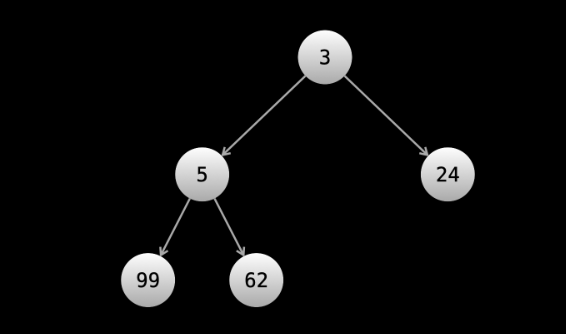

# Heap

A heap is a data structure that is an implementation of the priority queue.

Note that a priority queue is an abstract data structure. A heap is one of many ways to implement a priority queue. However, people often use the two terms interchangeably. In this course, we will use the term "heap".

A heap is a container that stores elements, and supports the following operations:

Add an element in O(logn)
Remove the minimum element in O(logn)
Find the minimum element in O(1)

    A heap can also find the max elements instead of the min elements. If a heap is configured to find/remove the min element, it's called a min heap. If it's configured to find/remove the max element, it's called a max heap.

The ability to find the max/min element in constant time, while only needing logarithmic time to maintain this ability through changes makes a heap an extremely powerful data structure.

## Essential Operations in Heaps

The following are the essential operations you might use when implementing a heap data structure:

heapify: rearranges the elements in the heap to maintain the heap property.
insert: adds an item to a heap while maintaining its heap property.
delete: removes an item in a heap.
extract: returns the value of an item and then deletes it from the heap.
isEmpty: boolean, returns true if boolean is empty and false if it has a node.
size: returns the size of the heap.
getMax(): returns the maximum value in a heap

## How is a heap implemented?

Like a hash map, all major programming languages will have support for a heap, so you don't need to implement it yourself. In terms of solving algorithm problems, you only really care about the interface, not how it is implemented. But like with hash maps, it's still good to understand the implementation in case you are asked about it in an interview.

There are multiple ways to implement a heap, although the most popular way is called a binary heap using an array. In the trees and graphs chapter, we saw that binary trees are typically implemented with a Node object.

A binary heap implements a binary tree, but with only an array. The idea is that each element in the array is a node in the tree. The smallest element in the tree is the root, and the following property is maintained at every node: if A is the parent of B, then A.val <= B.val. Notice that this property directly implies that the root is the smallest element.

    Another constraint is that the tree must be a complete tree.

The parent-child relationships are done using math with the indices. The first element at index 0 is the root, then the elements at indices 1 and 2 are the root's children, the elements at indices 3 and 4 are the children of the element at index 1 and the elements at indices 5 and 6 are the children of the element at index 2, and so on. If a node is at index i, then its children are at indices 2i + 1 and 2i + 2. When elements are added or removed, operations are done to maintain the aforementioned property of parent.val <= child.val. The number of operations needed scales logarithmically with the number of elements in the heap, and the process is known as "bubbling up".



    An existing array of elements can also be converted into a heap in linear time, although the process is complicated. Luckily, some major programming languages have built-in methods to do this.

    Remember: you shouldn't worry too much about how heaps are implemented. The important thing is that you understand the interface. We have included implementation details in this article for the sake of completeness.

In many problems, using a heap can improve an algorithm's time complexity from O(n^2) to O(n⋅logn), which is a massive improvement (for n = 1,000,000, this is 50,000 times faster). A heap is a great option whenever you need to find the maximum or minimum of something repeatedly.

## Operations

- Heapify is the process of creating a heap data structure from a binary tree. It is used to create a Min-Heap or a Max-Heap.
- Insert Element into Heap
- Delete Element from Heap
- Extract-Max/Min


## Creating a heap using an exisiting array

```js
function heapify(arr){
  const heap = []
  for(let item of arr){
     heappush(heap, item)
  }
  return heap;
}

function heappush(heap, newKey){
  // push the new key 
  heap.push(newKey);

  // get the current index of pushed key
  let curr = heap.length-1;

 // keep comparing till root is reached or we terminate in middle
  while(curr > 0){
    let parent = Math.floor((curr-1)/2)
    if( heap[curr] < heap[parent] ){
      // quick swap
      [ heap[curr], heap[parent] ] = [ heap[parent], heap[curr] ]
      // update the index of newKey
      curr = parent
    } else{
      // if no swap, break, since we heap is stable now
      break
    }
  } 
}

function heappop(heap){
  // swap root with last node
  const n = heap.length;
  [heap[0], heap[n-1]] = [ heap[n-1], heap[0]]

  // remove the root i.e. the last item (because of swap)
  const removedKey = heap.pop();

  let curr = 0;

  // keep going till atleast left child is possible for current node
  while(2*curr + 1 < heap.length){
    const leftIndex = 2*curr+1; 
    const rightIndex = 2*curr+2;
    const minChildIndex = (rightIndex < heap.length && heap[rightIndex] < heap[leftIndex] ) ? rightIndex :leftIndex;
    if(heap[minChildIndex] < heap[curr]){
     // quick swap, if smaller of two children is smaller than the parent (min-heap)
      [heap[minChildIndex], heap[curr]] = [heap[curr], heap[minChildIndex]]
      curr = minChildIndex
    } else {
      break
    }
  }

  // finally return the removed key
  return removedKey;
}

```

or 

```js
function heapify(heap){
  for(let i in heap){
     percolateDown(heap, i)
   }
  return heap
}

// follows pretty much the same logic as heappush, except minor modifications
function percolateDown(heap, index){
  let curr = index;
  // keep going down till heap property is established
  while(2*curr + 1 < heap.length){
    const leftIndex = 2*curr+1; 
    const rightIndex = 2*curr+2;
    const minChildIndex = (rightIndex < heap.length && heap[rightIndex] < heap[leftIndex] ) ? rightIndex :leftIndex;
    if(heap[minChildIndex] < heap[curr]){
     // quick swap, if smaller of two children is smaller than the parent (min-heap)
      [heap[minChildIndex], heap[curr]] = [heap[curr], heap[minChildIndex]]
      curr = minChildIndex
    } else {
      break
    }
}
```